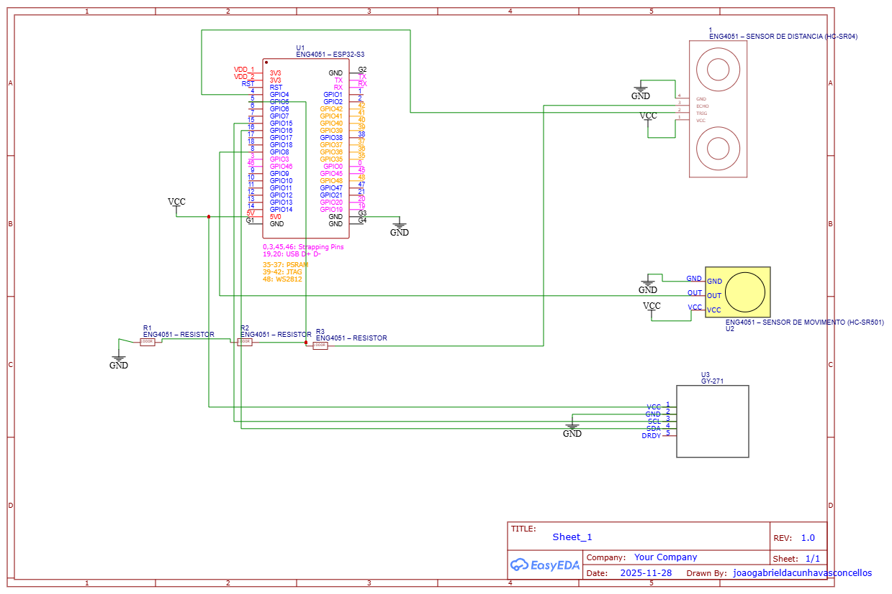
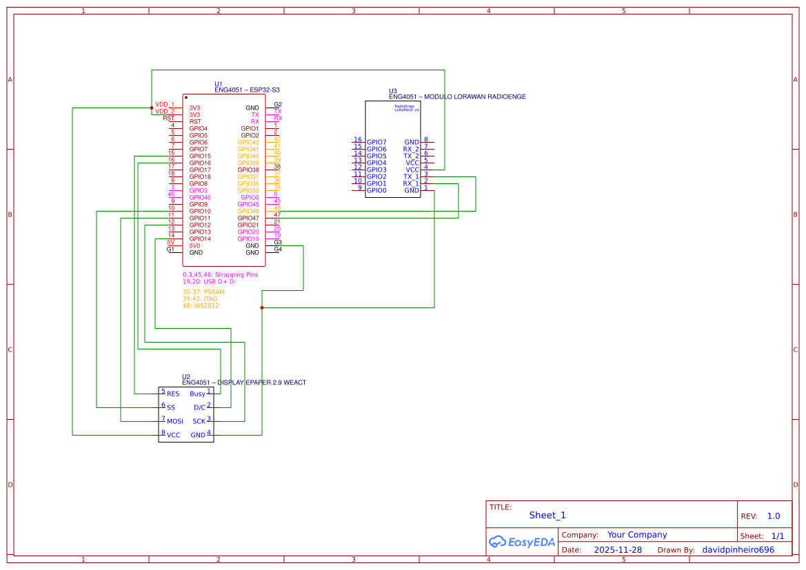
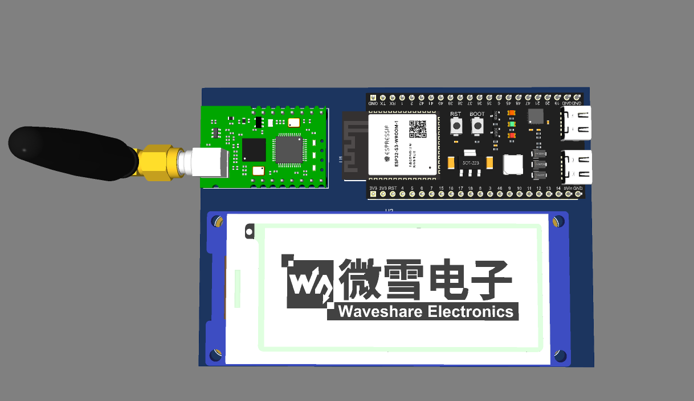
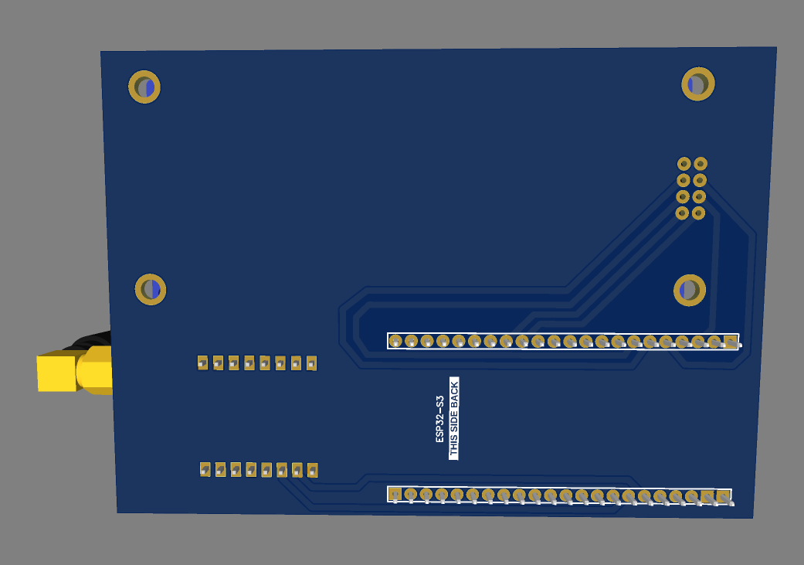
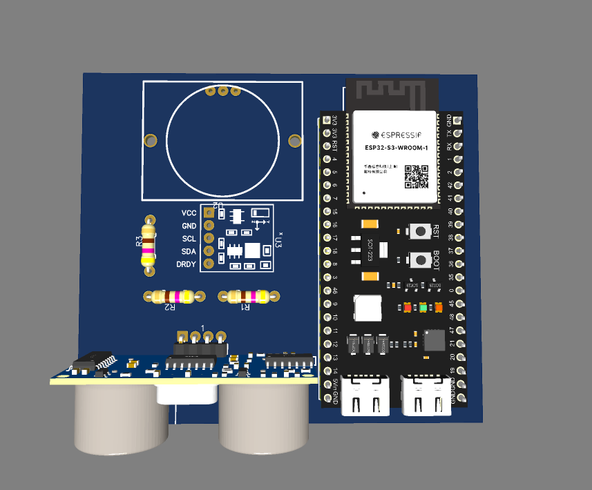
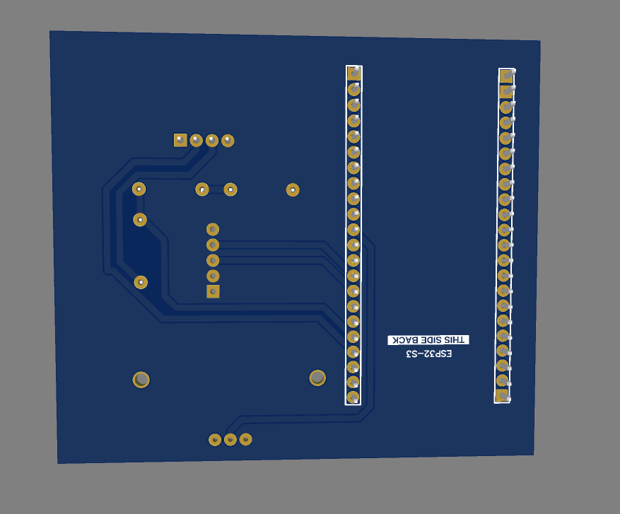

# Sistema de Monitoramento e Reserva de Vagas com ESP32, MQTT e Node-RED

Este projeto implementa um sistema completo de estacionamento inteligente, composto por:

- Placas com ESP32 instaladas em cada vaga, medindo ocupação via **sensor ultrassônico HC-SR04** e **sensor magnético (HMC5883L / GY-271)** como redundância em caso de falha do ultrassom.
- Uma segunda placa com **ESP32 + leitor de QR Code**, responsável por identificar qual usuário entrou na vaga.
- Comunicação local entre os ESP32 usando **ESP-NOW**.
- Backend baseado em **MQTT + Node-RED + PostgreSQL + Grafana**.
- Um **aplicativo web** para reserva de vagas, visualização de histórico e gráficos.

---

## 1. Descrição do Projeto

O objetivo do projeto é monitorar em tempo real a ocupação das vagas de estacionamento e associar cada evento (entrada/saída) a um usuário identificado por QR Code.

Cada vaga possui uma placa dedicada com ESP32 que:

- Usa o **HC-SR04** para medir a distância até o veículo.
- Usa o **HMC5883L** como sensor magnético de backup, detectando variação de campo quando o carro entra ou sai, caso o sensor de distância apresente falha.
- Envia o estado da vaga (livre/ocupada) e medições para o backend via **MQTT**.

Uma segunda placa com ESP32 (módulo de identificação):

- Lê um **QR Code** para identificar o usuário.
- Envia as informações do usuário e da vaga via **ESP-NOW** para a placa da vaga correspondente.
- A partir daí, os dados são encaminhados ao backend para registro em banco e exibição nos dashboards.

O backend:

- Recebe mensagens MQTT em um fluxo **Node-RED**.
- Registra dados de ocupação e identificação no banco **PostgreSQL**.
- Alimenta dashboards em **Grafana** e o aplicativo web de reserva de vagas.

---

## 2. Arquitetura Geral

A arquitetura é dividida em quatro grandes blocos:

1. **Camada de Dispositivos (Edge)**
   - ESP32 da vaga:
     - HC-SR04 (distância).
     - HMC5883L (campo magnético, redundância).
     - Lógica de decisão: se o ultrassom falhar (leituras inválidas ou fora da faixa), o sistema passa a usar apenas o sensor magnético para detectar entrada/saída pela variação do campo.
     - Publica mensagens MQTT com o estado da vaga (`disponivel`, `distancia`, `id_vaga`, etc.).
   - ESP32 com leitor de QR Code:
     - Lê o QR Code do usuário.
     - Usa **ESP-NOW** para enviar o identificador do usuário e da vaga para o ESP da vaga.

2. **Camada de Comunicação**
   - **ESP-NOW** para comunicação direta e de baixa latência entre os dois ESP32.
   - **MQTT** para comunicação dos ESP32 com o backend:
     - Tópicos de telemetria das vagas (por exemplo: `distancia/01`, `vaga/01/status`, etc.).
     - Opcionalmente, tópicos de comando (reserva, liberação, etc.).

3. **Backend (Node-RED + PostgreSQL + Grafana)**
   - **Node-RED**:
     - Conectado ao broker MQTT.
     - Processa mensagens recebidas dos ESP32.
     - Faz validações e transforma os dados.
     - Insere/atualiza registros no banco **PostgreSQL** (ocupação de vaga, usuário associado, timestamps, etc.).
   - **PostgreSQL**:
     - Banco relacional para:
       - Tabela de vagas.
       - Tabela de usuários.
       - Tabela de reservas.
       - Tabela de eventos de ocupação (telemetria das ESP).
   - **Grafana**:
     - Conectado ao PostgreSQL.
     - Exibe dashboards com:
       - Histórico de ocupação das vagas.
       - Estatísticas de uso.
       - Gráficos de sensores (distância, campo magnético, etc.).

4. **Aplicativo Web**
   - Interface para:
     - Reserva de vagas.
     - Visualização do status atual de cada vaga.
     - Consulta a históricos e gráficos.
   - Comunicação com o sistema:
     - Lê e grava dados diretamente no **PostgreSQL**.
     - As alterações no banco são refletidas no Node-RED e nos ESP32 conforme a lógica de integração definida (por exemplo, Node-RED pode ler mudanças no banco e enviar comandos via MQTT).

---

## 3. Esquemático do Circuito (EasyEDA)

O circuito principal foi desenhado no **EasyEDA** e inclui:

- ESP32.
- Sensor de distância **HC-SR04** (com divisor de tensão no pino ECHO, se necessário).
- Sensor magnético **HMC5883L / GY-271** conectado via I²C (pinos SDA/SCL).
- Sensor de movimento **HC-SR501**
- Modulo **LoraWan** para comunicação com o servidor.
- **Display ePaper**.

---

## 4. Dashboard das vagas

Visualização de disponibiliade e tipo de vagas.

